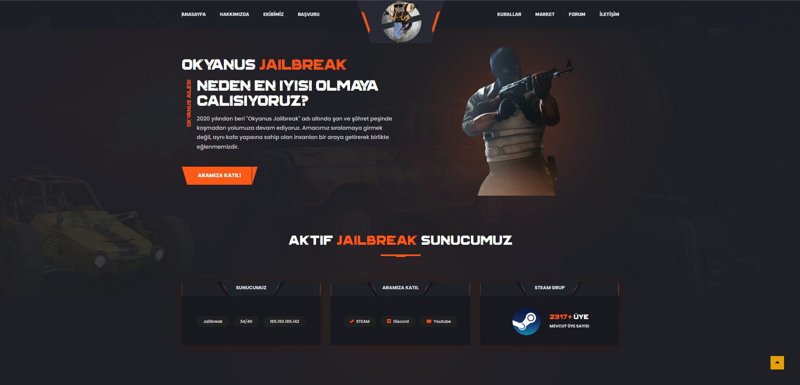

# CS2 Web Teması ile Tanışın!

Merhaba teknoloji severler! CS2 web teması ile karşınızdayız. Modern tasarım anlayışıyla hazırlanan bu tema, hem kişisel hem de kurumsal siteler için mükemmel bir çözüm sunuyor. Kullanıcı dostu arayüzü, hızlı yüklenme süreleri ve SEO uyumlu yapısı ile web sitenizi Google’da üst sıralara taşıyacak.

**Daha fazlasını görmek için internet sitemi ( https://marthex.dev/ ) ziyaret etmeyi unutma.**

---

## Kurulum

1. **Dosyaları İndirin:**  
   Projenin en güncel sürümünü GitHub reposundan veya ilgili kaynaklardan indirin.

2. **Yükleme:**  
   İndirdiğiniz dosyaları web sunucunuza veya hosting hesabınıza yükleyin.  
   Temanın statik dosyaları (HTML, CSS, JavaScript) sayesinde kurulum süreci oldukça hızlı tamamlanır.

3. **Test:**  
   Yükleme tamamlandıktan sonra, sitenizin sorunsuz çalıştığından emin olmak için yerel veya canlı sunucuda test ediniz.

---

## Özelleştirme

- **HTML & CSS Düzenlemeleri:**  
  Temanın genel yapısını ve stilini ihtiyacınıza göre kolayca değiştirebilirsiniz. Renkler, fontlar ve düzen ayarları tamamen size özeldir.

- **SEO Ayarları:**  
  Meta etiketleri, başlıklar ve diğer SEO bileşenlerini düzenleyerek, arama motoru optimizasyonunuzu güçlendirebilirsiniz.

- **JavaScript Fonksiyonları:**  
  Tema içerisinde kullanılan dinamik öğeleri kendi ihtiyaçlarınıza göre uyarlayabilir veya ek özellikler geliştirebilirsiniz.

---
## Görüntü

